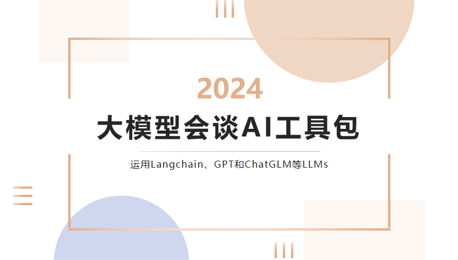
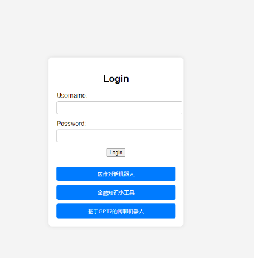
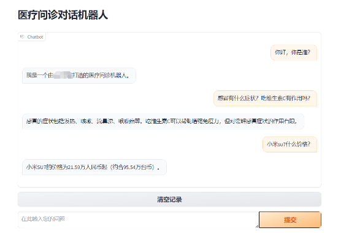
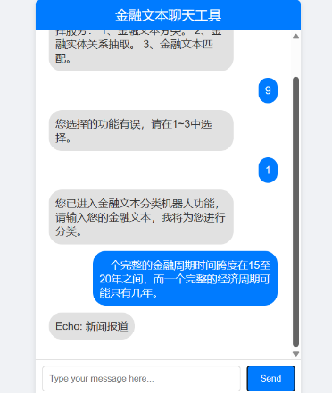
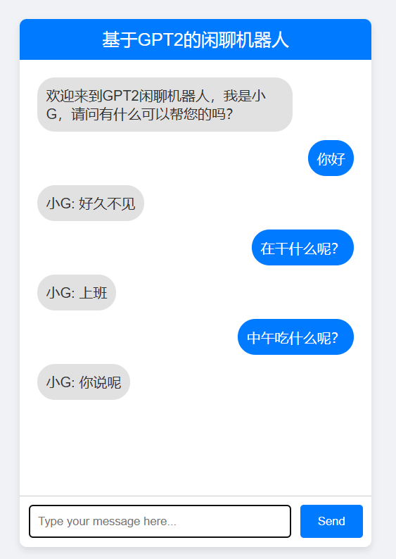

# 1. 介绍：

基于大模型的**多功能聊天机器人工具箱**，包括三个主要的工具：**1、一个基于LangChain的医疗问答机器人**
，专门针对医疗领域的咨询和问题解答；**2、一个基于ChatGLM的文本工具，能够进行文本分类、实体关系抽取和文本匹配**
，适用于处理复杂的文本信息；**3、一个基于GPT-2的全精度微调闲聊机器人**
，提供更自然的对话体验。这些工具使用不同的技术实现，为开发者快速搭建和部署专业的聊天机器人提供了灵活性和高效性。

同时本项目安装部署简单，并提供可交互式的聊天界面。

本项目演示效果：
①登录界面



②基于Langchain的医疗对话机器人：


③基于ChatGLM的文本工具：



④基于GPT2的闲聊机器人：



# 2. 快速上手

## 2.1 环境配置

- 首先，确保你的机器安装了Python 3.8 - 3.11（推荐Python3.9以上）

```shell
#创建一个虚拟环境
conda create -n your_env_name python=3.9
```

- 切换到你的环境，下载安装pytorch(也可自己在pytorch官网下载:https://pytorch.org/)

> ```shell
> pip3 install torch torchvision torchaudio --index-url https://download.pytorch.org/whl/cu118
> ```

- 接着，在虚拟环境中安装依赖：

```shell
#进入项目目录
$ cd LLM_Robot
#安装全部依赖
$ pip install -r requirements.txt
```

## 2.2 模型下载

如需在本地或者离线环境下运行本项目，需要首先将项目所需要的模型下载至本地，通常开源LLM模型可以在HuggingFace下载。以本项目中默认使用的LLM模型THUDM/ChatGLM-6B为例：

下载模型需要先安装Git LFS，然后运行

```shell
$ git lfs install
$ git clone https://huggingface.co/THUDM/chatglm-6b
```

## 2.3 启动

可以分别启动各个项目的flask，app.py代表：基于ChatGLM的文本工具，doctor_app.py代表：基于LangChain的医疗问答机器人，gpt2_app.py代表：基于GPT-2的全精度微调闲聊机器人

```shell
$ python app.py
$ python doctor_app.py
$ python gpt2_app.py
```

**注意：**本项目的医疗对话机器人是基于OpenAI的gpt3.5，所以需要有OpenAI的key，大家替换成自己的key即可，当然也可以换成千帆大模型，**但是部分代码需要做出一些变动**。
